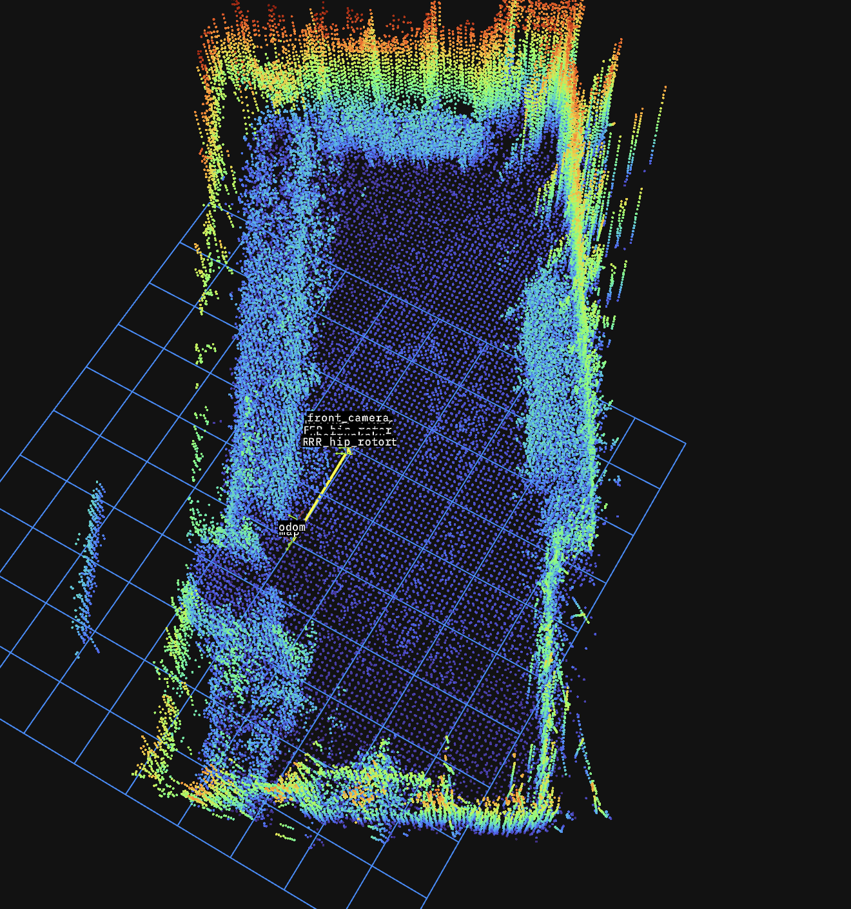

# My SLAM

## Overview
#  `The solution is preconfigured for the Unitree Go2 robot.`

**My SLAM** is a lightweight, real-time **Simultaneous Localization and Mapping** system implemented in C++17 using ROS 2. It performs scan-to-map registration via point-to-plane ICP (Gauss-Newton optimization) and maintains both local and global 3D point cloud maps using voxel-based data structures.

**Key Features:**
- Real-time ICP-based LiDAR odometry and mapping
- Local map management with keyframe tracking
- Voxel hash map for efficient global map representation
- Multi-threaded processing (OpenMP support)
- Robust outlier rejection and planarity checks
- Parameter-driven configuration for easy tuning


---

## System Requirements

- **ROS 2** (tested on Humble/Iron)
- **C++17** compiler (GCC or Clang)
- **CMake 3.8+**
- **PCL** (Point Cloud Library)
- **Eigen3**
- **OpenMP** (optional, for parallelization)

---

## Installation

### 1. Clone the Repository
```bash
cd ~/ros2_ws/src
git clone https://github.com/szonyibalazs/keyframe-slam-go2
cd keyframe-slam-go2
```

### 2. Build
```bash
cd ~/ros2_ws
colcon build --packages-select my_slam
source install/setup.bash
```

---

## Usage

### Launch the Node

```bash
ros2 launch my_slam my_slam_launch.py
```

#### Launch Arguments

- `cloud_topic` (default: `/utlidar/cloud_deskewed`) — Input LiDAR point cloud topic
- `map_save_path` (default: `/tmp/my_slam_map.pcd`) — Path where the final map is saved

**Example with custom topic:**
```bash
ros2 launch my_slam my_slam_launch.py cloud_topic:=/velodyne_points map_save_path:=/home/user/my_map.pcd
```

### Save the Map

Call the ROS service to save the current global map:

```bash
ros2 service call /my_slam/save_map std_srvs/srv/Trigger
```

The map is saved as a binary PCD file at the configured path.

---

## Parameters

### Input/Output Topics & Frames

| Parameter | Default | Description |
|-----------|---------|-------------|
| `cloud_topic` | `/utlidar/cloud_deskewed` | Input point cloud topic |
| `map_frame` | `map` | Global map frame |
| `odom_frame` | `odom` | Odometry frame (from robot base) |
| `base_frame` | `base_link` | Robot base frame |
| `fallback_sensor_frame` | `utlidar_lidar` | Fallback LiDAR frame if header is empty |
| `map_save_path` | `/tmp/my_slam_map.pcd` | Path to save the global map |

### Point Cloud Filtering (base_link frame)

| Parameter | Default | Description |
|-----------|---------|-------------|
| `min_range` | 0.4 m | Minimum point distance from sensor |
| `max_range` | 40.0 m | Maximum point distance from sensor |
| `min_z_base` | -1.0 m | Minimum Z in base_link frame |
| `max_z_base` | 3.0 m | Maximum Z in base_link frame |

### Downsampling / Voxel Resolution

| Parameter | Default | Description |
|-----------|---------|-------------|
| `icp_leaf` | 0.25 m | Voxel size for ICP input (speed optimization) |
| `map_leaf` | 0.10 m | Voxel size for scan added to global map |
| `local_map_leaf` | 0.20 m | Local map voxel size (ICP reference) |
| `global_map_leaf` | 0.10 m | Global voxel hash map resolution |

### Keyframe & Local Map Management

| Parameter | Default | Description |
|-----------|---------|-------------|
| `keyframe_dist` | 0.5 m | Translation threshold to create a new keyframe |
| `keyframe_angle` | 0.26 rad | Rotation threshold to create a new keyframe (~15°) |
| `local_map_radius` | 40.0 m | Radius around current pose for local map |
| `local_map_max_keyframes` | 50 | Max keyframes to include in local map |

### ICP Algorithm Parameters

| Parameter | Default | Description |
|-----------|---------|-------------|
| `max_iterations` | 20 | Max Gauss-Newton iterations per scan |
| `min_correspondences` | 60 | Minimum valid point-plane correspondences |
| `max_icp_points` | 15000 | Max points sampled for ICP (for real-time speed) |
| `max_correspondence_dist` | 1.0 m | Max distance to local map points |
| `plane_threshold` | 0.10 m | Planarity tolerance for surface detection |
| `huber_delta` | 0.10 m | Huber loss threshold for robustness |
| `max_position_correction` | 1.0 m | Max translation correction per frame |
| `max_angle_correction` | 0.35 rad | Max rotation correction per frame (~20°) |

### Performance & Publishing

| Parameter | Default | Description |
|-----------|---------|-------------|
| `tf_timeout` | 0.05 s | TF lookup timeout |
| `map_publish_period` | 2.0 s | Interval for publishing global map |
| `num_threads` | 4 | OpenMP thread count for ICP |
| `publish_registered_scan` | `true` | Publish filtered scan in map frame |
| `use_sim_time` | `false` | Use `/clock` for simulation |

---

## Published Topics

| Topic | Type | Description |
|-------|------|-------------|
| `/my_slam/map` | `sensor_msgs/PointCloud2` | Global map (latched, published every `map_publish_period`) |
| `/my_slam/local_map` | `sensor_msgs/PointCloud2` | Current local map used for ICP matching |
| `/my_slam/scan_registered` | `sensor_msgs/PointCloud2` | Current scan registered in map frame |
| `/my_slam/odometry` | `nav_msgs/Odometry` | Pose and twist in map frame |
| `/my_slam/path` | `nav_msgs/Path` | Robot trajectory in map frame (sparse) |

## Broadcast Transform

| From | To | Description |
|------|-----|-------------|
| `map` | `odom` | Pose correction from scan matching |

---

## Services

### `/my_slam/save_map` (std_srvs/Trigger)

Saves the current global map to disk as a binary PCD file.

**Request:** (empty)  
**Response:**
- `success` (bool): Whether the save succeeded
- `message` (string): Status message

**Example:**
```bash
ros2 service call /my_slam/save_map std_srvs/srv/Trigger
```

---

## Algorithm Overview

### 1. **Preprocessing**
- Filters points by range and height
- Transforms from sensor frame to base_link
- Downsamples for ICP and global map insertion

### 2. **ICP Alignment** (Point-to-Plane, Gauss-Newton)
- Finds nearest neighbors (k=5) in local KD-tree
- Fits planes to local neighborhoods
- Checks planarity and outliers
- Applies Huber weighting and range-based weighting
- Solves normal equations with Levenberg-type damping
- Validates pose corrections against limits

### 3. **Keyframe Management**
- Creates keyframes when translation or rotation exceeds thresholds
- Maintains up to `local_map_max_keyframes_` recent frames
- Stores frames as voxel-downsampled clouds

### 4. **Local Map Reconstruction**
- Builds local map from nearby keyframes (within `local_map_radius_`)
- Updates KD-tree for next scan's ICP

### 5. **Global Map**
- Voxel hash map with averaging (up to 20 points per voxel)
- Decoupled from local map to reduce drift accumulation
- Published at regular intervals; can be saved on demand

---

## Tuning Guide

### For **slow/indoor environments** (Turtlebot, handheld):
```python
'icp_leaf': 0.15,
'map_leaf': 0.05,
'max_correspondence_dist': 0.5,
'max_range': 10.0,
'local_map_radius': 15.0,
```

### For **fast outdoor environments** (wheeled robot, drone):
```python
'icp_leaf': 0.5,
'max_icp_points': 10000,
'keyframe_dist': 1.0,
'keyframe_angle': 0.35,
'max_correspondence_dist': 1.5,
```

### For **accuracy-first** (offline processing):
```python
'max_iterations': 50,
'icp_leaf': 0.10,
'huber_delta': 0.05,
'min_correspondences': 100,
```

### For **speed-first** (real-time on embedded):
```python
'icp_leaf': 0.5,
'max_icp_points': 8000,
'num_threads': 2,
'map_publish_period': 5.0,
```

---

## Troubleshooting

### **"Few ICP correspondences" warning**
- Increase `local_map_radius` or `local_map_max_keyframes`
- Lower `plane_threshold` (allow noisier planes)
- Verify LiDAR is publishing healthy data
- Check TF chain (map → odom → base_link → sensor)

### **Slow processing (> 100 ms)**
- Increase `icp_leaf` (coarser downsampling)
- Reduce `max_icp_points`
- Lower `num_threads` if system is overloaded
- Increase `map_publish_period` if map publishing is a bottleneck

### **Map appears fragmented or jumps**
- Lower `max_position_correction` and `max_angle_correction`
- Increase `min_correspondences`
- Check for dynamic objects in the scene
- Verify odometry input is accurate

### **TF errors**
- Ensure TF is being published (check with `ros2 tf2_echo`)
- Increase `tf_timeout` if network latency is high
- Verify timestamps in all messages are synchronized

---

## File Structure

```
keyframe-slam-go2/
├── CMakeLists.txt
├── package.xml
├── include/
│   └── my_slam/
│       └── my_slam.hpp          # Class definition & data structures
├── src/
│   └── my_slam.cpp              # Implementation
└── launch/
    └── my_slam_launch.py        # ROS 2 launch file
```

---

## Dependencies

```xml
<!-- package.xml -->
<depend>rclcpp</depend>
<depend>sensor_msgs</depend>
<depend>nav_msgs</depend>
<depend>geometry_msgs</depend>
<depend>std_srvs</depend>
<depend>tf2</depend>
<depend>tf2_ros</depend>
<depend>tf2_eigen</depend>
<depend>pcl_conversions</depend>
<depend>pcl</depend>
<depend>eigen</depend>
```

---

## Performance Notes

- **Typical real-time performance:** 10–50 ms per scan on modern hardware
- **Memory footprint:** ~500 MB for ~500k map points (voxel hash map)
- **Scalability:** Global map can grow indefinitely (voxel averaging prevents bloat)
- **Thread safety:** Mutex-protected map access; ICP loop uses OpenMP for per-point parallelism

---

## Contributing & License

Contributions welcome! Please submit issues and pull requests.

**License:** [Apache 2.0 / MIT / Your Choice]

---

## References

- **Point-to-Plane ICP:** Rusinkiewicz & Levoy, 2001
- **Huber Robust Loss:** Huber, 1964
- **PCL Documentation:** [Point Cloud Library](https://pointclouds.org/)
- **ROS 2 Docs:** [docs.ros.org](https://docs.ros.org/)

---

## Contact & Support

For questions or issues:
- Open a GitHub issue

---

**Happy mapping! 🗺️**
